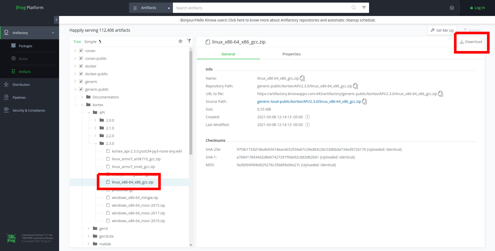

<!--
* KINOVA (R) KORTEX (TM)
*
* Copyright (c) 2018 Kinova inc. All rights reserved.
*
* This software may be modified and distributed
* under the terms of the BSD 3-Clause license.
*
* Refer to the LICENSE file for details.
*
-->

<h1>KINOVA® KORTEX™ API Reference</h1>

# Description

The official repository contains documentation and examples explaining how to use the KINOVA® KORTEX™ API client with C++ or Python.
The repository has been tested on Windows 10, Ubuntu 16.04, Ubuntu 18.04 and Ubuntu 20.04.

<h1>Table of Contents</h1>

<!-- TOC -->

- [Description](#description)
- [Licensing](#licensing)
- [Role of Google Protocol Buffer in Kortex API](#role-of-google-protocol-buffer-in-kortex-api)
  - [Quick Start for C++ users](#quick-start-for-c-users)
  - [Quick Start for Python users](#quick-start-for-python-users)
  - [Quick Start for modbus users](#quick-start-for-modbus-users)
- [Download links](#download-links)
- [Build and Run instructions](#build-and-run-instructions)

<!-- /TOC -->

# Licensing 
This repository is licenced under the [BSD 3-Clause "Revised" License](./LICENSE) 

# Role of Google Protocol Buffer in Kortex API 

The Kortex API uses Google Protocol Buffer message objects to exchange data between client and server.  

Google Protocol Buffer offers structured data objects with standard methods for each member field:

- structured, nested objects 
- basic types and collections 
- getter/setter methods on basic types 
- iterators, dimension and appending methods on collections 
- many helpers (e.g. serialize/deserialize, I/O functions)

When using the Kortex API a developer will need to understand the Google Protocol Buffer feature set to maximize their efficiency.

## Quick Start for Python users

To run the Python examples you will need to install the Python interpreter and the pip installation module.

Note that for C++ developers it could be useful to install the Python Kortex API to allow for quick tests and validations.

Here is some general information about the Python interpreter and the pip module manager.

- [Python General Information](./linked_md/python_quick_start.md)
- [API mechanism](./linked_md/python_api_mechanism.md)
- [Transport / Router / Session / Notification](./linked_md/python_transport_router_session_notif.md)
- [Device routing](./linked_md/python_device_routing.md)
- [Servoing modes](./linked_md/python_servoing_modes.md)
- [Error management](./linked_md/python_error_management.md)
- [Examples](./examples/python.md)

# Download links

The latest download links for each arm type are reported in the table below:

| Arm type       | Firmware     | Release notes      | API |
| :------------- | :----------: | :-----------: | :-----------:|
|  Gen3 | [2.4.0](https://artifactory.kinovaapps.com/ui/api/v1/download?repoKey=generic-public&path=kortex%2Fgen3%2F2.4.0%2FGen3-2.4.0.swu)   | [2.5.0](https://artifactory.kinovaapps.com/ui/api/v1/download?repoKey=generic-public&path=Documentation%2FGen3%2FTechnical%20documentation%2FRelease%20notes%2FEN-eRN-001-Gen3-Ultralight-release-notes.pdf)    | [2.5.0](https://artifactory.kinovaapps.com/ui/repos/tree/General/generic-public/kortex/API/2.5.0/)|
| Gen3 lite   | [2.3.2](https://artifactory.kinovaapps.com/ui/api/v1/download?repoKey=generic-public&path=kortex%2Fgen3Lite%2F2.3.2%2FGen3-lite-2.3.2.swu) | [2.3.2](https://artifactory.kinovaapps.com/ui/api/v1/download?repoKey=generic-public&path=Documentation%2FGen3%20lite%2FTechnical%20documentation%2FRelease%20Notes%2FGen3_lite_Release_Notes_2_3_2%20-%20R01.pdf) | [2.3.0](https://artifactory.kinovaapps.com/ui/repos/tree/General/generic-public%2Fkortex%2FAPI%2F2.3.0)|

When following the link to Artifactory, to download the correct C++ API, you have to select the package for your architecture on the left-hand side tree view and then click Download on the right-hand side:

 

Previous releases

<ul>
<li>
Release 2.2.0 for Gen3: <a href="https://artifactory.kinovaapps.com/artifactory/generic-public/kortex/gen3/2.2.0/Gen3-2.2.0.swu">Firmware</a>, <a href="https://artifactory.kinovaapps.com/artifactory/generic-public/kortex/gen3/2.2.0/RN-001_KINOVA_Gen3_Ultra_lightweight_robot-Release_Notes_EN_R06.pdf">Release Notes</a>, <a href="https://artifactory.kinovaapps.com/ui/repos/tree/General/generic-public%2Fkortex%2FAPI%2F2.2.0">Kortex API</a>
</li>
<li>
Release 2.1.1 for Gen3 lite: <a href="https://artifactory.kinovaapps.com/artifactory/generic-local-public/kortex/gen3Lite/2.1.1/Gen3Lite-2.1.1.swu">Firmware</a>, <a href="https://artifactory.kinovaapps.com/artifactory/generic-local-public/kortex/gen3Lite/2.1.1/RN-002_Gen3_lite_robot_Release_Notes_EN_R01.pdf">Release Notes</a>, <a href="https://artifactory.kinovaapps.com/artifactory/generic-local-public/kortex/API/2.1.0/kortex_api_2.1.0.zip">Kortex API</a>
</li>
<li>
Release 2.0.1 for Gen3: <a href="https://artifactory.kinovaapps.com/artifactory/generic-public/kortex/gen3/2.0.1/Gen3-2.0.1.swu">Firmware</a>, <a href="https://artifactory.kinovaapps.com/artifactory/generic-public/kortex/gen3/2.0.1/RN-001_KINOVA_Gen3_Ultra_lightweight_robot-Release_Notes_EN_R05%20(1).pdf">Release Notes</a>, <a href="https://artifactory.kinovaapps.com/artifactory/generic-local-public/kortex/API/2.0.0/kortex_api_2.0.0.zip">Kortex API</a>
</li>
<li>
Release 2.0.0 for Gen3: <a href="https://artifactory.kinovaapps.com/artifactory/generic-local-public/kortex/gen3/2.0.0/Gen3-2.0.0.swu">Firmware</a>, <a href="https://artifactory.kinovaapps.com/artifactory/generic-local-public/kortex/gen3/2.0.0/RN-001_KINOVA_Gen3_Ultra_lightweight_robot-Release_Notes_EN_R04.pdf">Release Notes</a>, <a href="https://artifactory.kinovaapps.com/artifactory/generic-local-public/kortex/API/2.0.0/kortex_api_2.0.0.zip">Kortex API</a>
</li>
</ul>

# Build and Run instructions
[Python API](./examples/python.md)

#### Useful Links
|  |  |
| ---: | --- |
| Kinova home page: | [https://www.kinovarobotics.com](https://www.kinovarobotics.com)|
| Google Protocol Buffers home page: | [https://developers.google.com/protocol-buffers](https://developers.google.com/protocol-buffers) |